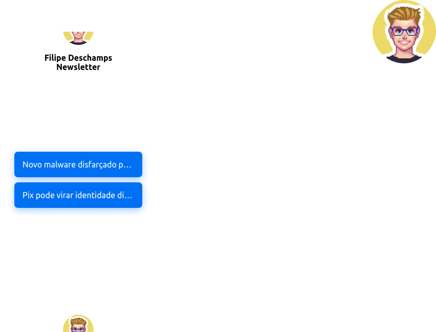

<div align='center'>
  
  
  <div align='center'>
    
    
    <h1>Filipe Deschamps Newsletter Viewer</h1>
  </div>
</div>

<a id='#sobre'></a>
## Sobre o projeto

Esse projeto surgiu de uma nescessidade em que eu queria poder ler as noticias da newsletter onde eu não precisasse abrir minha caixa de e-mails, 
ou seja ter um app independente para poder ver as noticias.

Então decidi criar uma aplicação em Electron em que pudesse acessar minha caixa de e-mails e extrair todos os e-mails dela onde o remetente seja **Filipe Deschamps Newsletter**.

<a id='#tecnologias'></a>
## Tecnologias 🖥️

As tecnologias que usei nesse projeto foram

- [Electron](https://electronjs.org) *Para o criar um app desktop com HTML, CSS e JavaScript*
- [IMAP Simple](https://github.com/chadxz/imap-simple) *Para extrair os e-mails da caixa*
- [Mailparser](https://nodemailer.com/extras/mailparser/) *Para transformar os e-mail extraídos em um HTML legível ao browser*
- [Lodash](https://lodash.com/) *Lib com algumas funções ja prontas* 😉
- [Dotenv](https://github.com/motdotla/dotenv) *Usei para ler variáveis de ambiente do projeto*

<a id='#como-executar'></a>
## Como executar 🧐

Para executar o projeto, siga esses passos

*Obs: usando o yarn*
```sh
git clone https://github.com/Guigalaverna/deschamps-newsletter-electron-app

cd deschamps-newsletter-electron-app

yarn install

yarn electron
```

*Obs: usando o npm*

```sh
git clone https://github.com/Guigalaverna/deschamps-newsletter-electron-app

cd deschamps-newsletter-electron-app

npm install

npm run electron
```

*Obs: antes de iniciar o app, preencha o arquivo `.env` com as suas informações.*

## Bugs 👾

- Provavelmente ao executar o app pela primeira vez os posts da newsletter não apareçam, 
então é só fechar e tentar abrir de novo. Pois na primeira vez a aplicação baixa os e-mails e faz a conversão

## Quer me ajudar 👋

Se vc decidiu me ajudar no desenvolvimento desse projeto, para contribuir com ele, siga esses passos:

1. Faça um fork do projeto.
2. Clone o repositório na sua máquina.
3. Faça sua alteração (feature, bug fix...).
4. Faça um commit da suas alterações.
5. Então crie uma pull-request
